# NLP Sentiment Analysis: Employee Review Classification

**Can I predict how an employee feels about their company just from the words they write?**

This project takes ~30,000 employee reviews and builds four different machine learning models to classify each review as **Negative**, **Neutral**, or **Positive** based on the text alone. It walks through the full data science pipeline — from raw data to model comparison — demonstrating four distinct algorithm families: logistic regression, random forests, gradient boosting, and neural networks.

---

## The Problem

Employees leave written reviews about their companies. Each review comes with a star rating (1-5), but the interesting question is: **can I determine the sentiment from the text itself, without seeing the star rating?**

This matters because in real HR software (like performance reviews, engagement surveys, and exit interviews), there often *is no star rating* — just free-form text. A model that understands tone and sentiment can automatically surface insights from thousands of responses.

### How I Define Sentiment

I group the 1-5 star ratings into three classes:

| Sentiment | Star Ratings | What It Means |
|-----------|-------------|---------------|
| **Negative** | 1-2 stars | Employee is unhappy |
| **Neutral** | 3 stars | Mixed feelings |
| **Positive** | 4-5 stars | Employee is satisfied |

---

## The Dataset at a Glance

I start with **30,281 cleaned reviews** sourced from Kaggle. Here's what the rating distribution looks like:

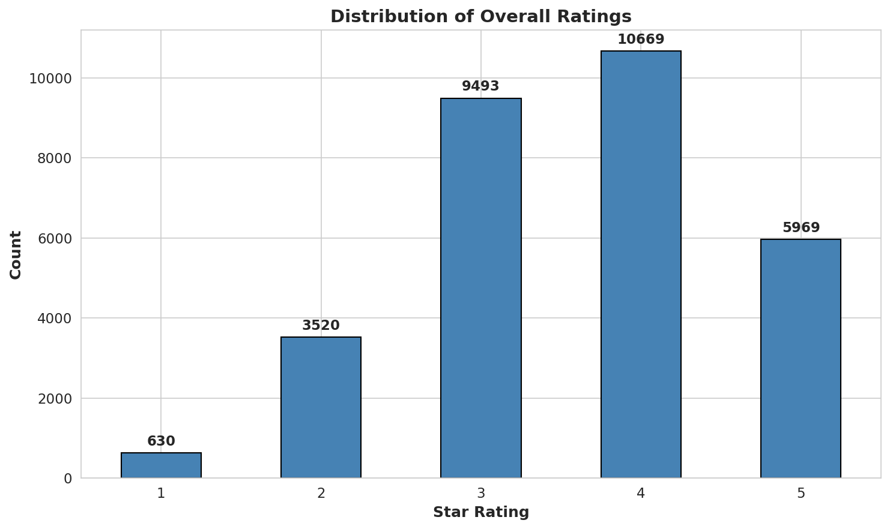

Most reviewers gave 3-4 stars. When I collapse these into three sentiment classes, the imbalance becomes clear:

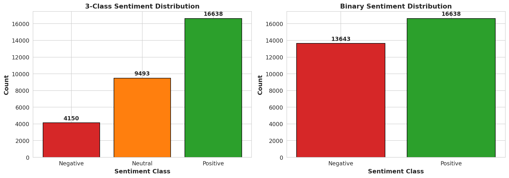

| Class | Count | Percentage |
|-------|------:|----------:|
| Negative (1-2 stars) | 4,150 | 13.7% |
| Neutral (3 stars) | 9,493 | 31.3% |
| Positive (4-5 stars) | 16,638 | 54.9% |

The dataset is **imbalanced** — there are 4x more positive reviews than negative ones. This is common in employee reviews (most people don't write reviews unless they're happy or very unhappy) and makes the classification harder because models can "cheat" by just predicting Positive for everything.

### Review Lengths

Most reviews are short — the median is just 209 characters (about 2 sentences), though some go over 10,000:

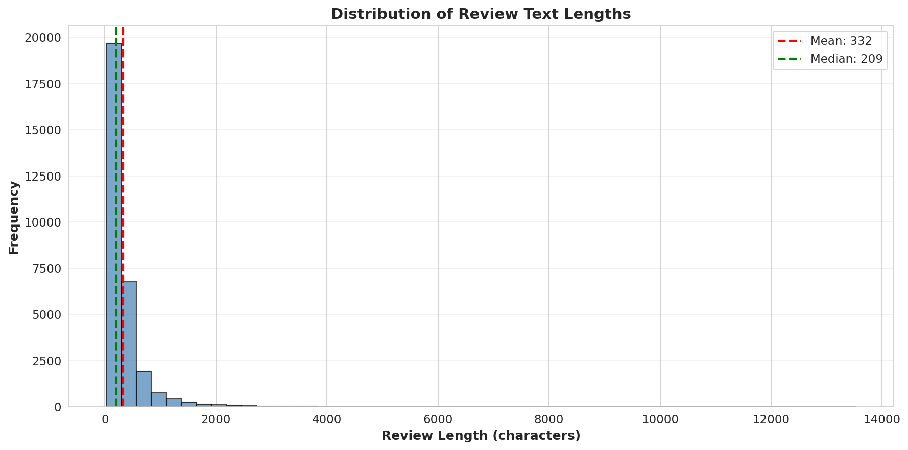

### What Words Appear in Each Sentiment?

Looking at the most frequent words by sentiment class reveals interesting patterns:

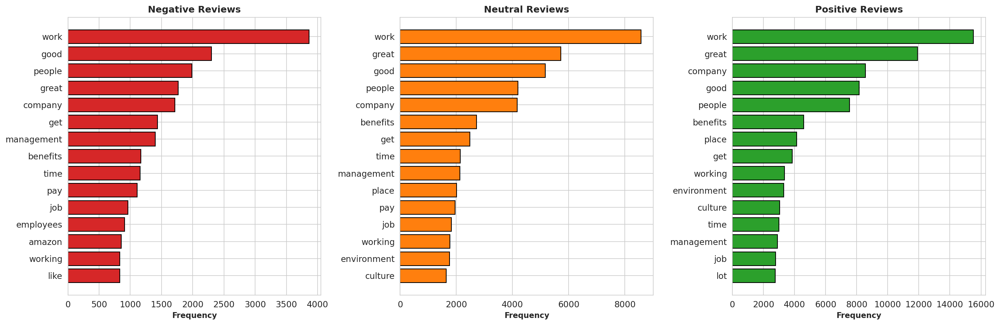

Words like *"management"*, *"pay"*, and *"employees"* appear more heavily in negative reviews, while *"great"*, *"culture"*, and *"benefits"* dominate positive reviews. The neutral reviews share vocabulary with both — which hints at why the Neutral class is so hard to classify.

---

## How the Pipeline Works

```
Raw Reviews ──> Clean Text ──> Split Data ──> Train Models ──> Evaluate & Compare
    (00)          (02)          (02)         (03-06)            (07)
```

### Step 1: Data Collection (Notebook 00)

Download employee reviews from Kaggle, combine the "positives" and "negatives" text fields into a single review, create sentiment labels from the star ratings, and upload to S3.

### Step 2: Exploratory Data Analysis (Notebook 01)

Visualize the data to understand distributions, word patterns, and class imbalance before building any models.

### Step 3: Text Preprocessing (Notebook 02)

Raw text is messy. Before feeding it to models, I clean it:

1. **Lowercase** everything
2. **Remove punctuation** and special characters
3. **Remove stopwords** ("the", "is", "at") that add noise
4. **Lemmatize** words — reduce "running", "runs", "ran" all to "run"

Then I split the data into three sets:

| Split | Size | Purpose |
|-------|-----:|---------|
| **Train** | 18,168 (60%) | Models learn from this |
| **Validation** | 6,056 (20%) | Tune hyperparameters |
| **Test** | 6,057 (20%) | Final evaluation (never seen during training) |

The splits are **stratified** — each set has the same ~14% / 31% / 55% class ratio as the full dataset.

### Step 4: Model Training (Notebooks 03-06)

I train four different models. The first three use **TF-IDF** (Term Frequency-Inverse Document Frequency) to convert text into numbers. Think of TF-IDF as a way to score how important each word is to a given review — common words like "work" get lower scores while distinctive words like "toxic" or "amazing" get higher scores.

The fourth model (LSTM) takes a completely different approach by processing the text as a *sequence* of words.

---

## The Four Models

### Model 1: Logistic Regression

**The simplest approach.** Logistic regression draws a linear decision boundary in the TF-IDF feature space. Despite its simplicity, it's a strong baseline for text classification because text data is often linearly separable in high dimensions.

- **Features**: 3,000 TF-IDF unigram features
- **Tuning**: Optuna (10 trials) — tunes regularization strength (C), solver, and class weights
- **Strength**: Fast, interpretable, coefficients show which words drive predictions

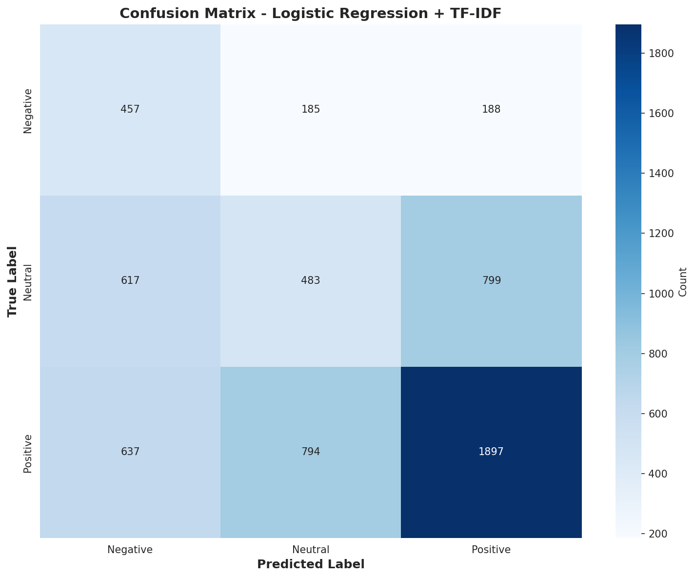

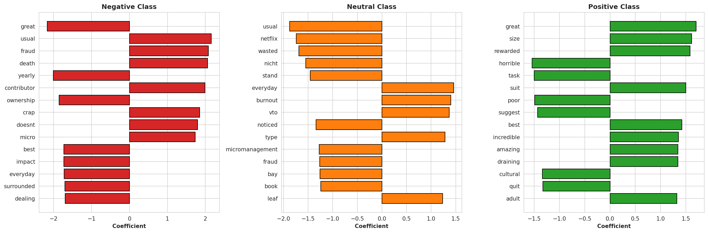

The feature importance plot shows which words the model associates most strongly with each class. The coefficients are directly interpretable — a large positive coefficient for "toxic" under Negative means that word pushes the prediction toward Negative.

---

### Model 2: Random Forest

**An ensemble of decision trees.** Each tree sees a random subset of the data and features, then they all vote on the final prediction. This reduces overfitting compared to a single decision tree.

- **Features**: 3,000 TF-IDF unigram features
- **Tuning**: Optuna (10 trials) — tunes number of trees (50-150), max depth, min samples per split, and class weights
- **Strength**: Handles non-linear patterns, built-in feature importance, SHAP explanations

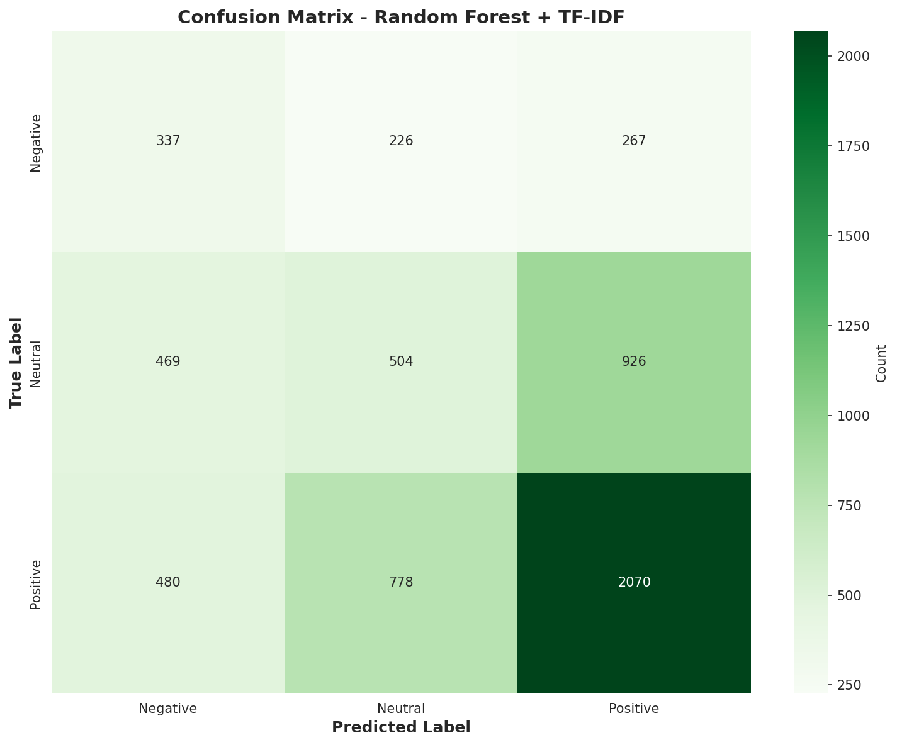

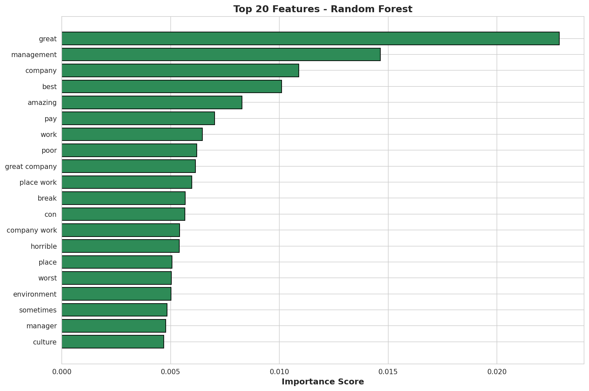

---

### Model 3: XGBoost (Gradient Boosting)

**Trees that learn from each other's mistakes.** Unlike Random Forest (which builds trees independently), XGBoost builds trees *sequentially* — each new tree focuses on the examples the previous trees got wrong.

- **Features**: 3,000 TF-IDF unigram features
- **Tuning**: Optuna (10 trials) — tunes learning rate, max depth, regularization (gamma, alpha, lambda), subsampling, and class weights
- **Early stopping**: Stops adding trees when validation loss stops improving (patience=10 rounds)
- **Strength**: Often the best performer on tabular/structured data

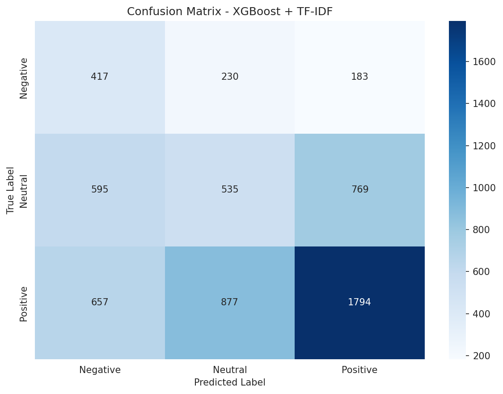

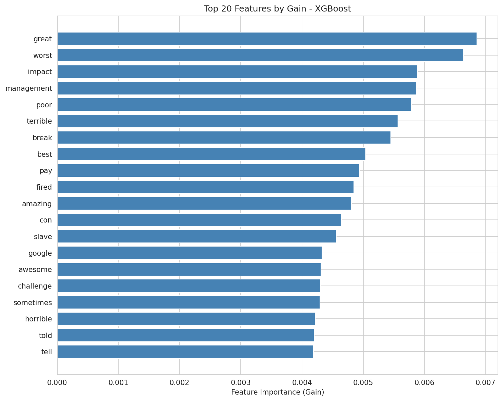

---

### Model 4: LSTM Neural Network (PyTorch)

**A deep learning approach that reads text as a sequence.** The three TF-IDF models treat each review as a "bag of words" — they know *which* words appear but not *what order* they're in. The LSTM (Long Short-Term Memory) network processes words one at a time, maintaining a memory of what it has seen so far.

- **Architecture**: Embedding(5000, 64) → LSTM(64) → Dense(32) → Dense(3)
- **Training**: Adam optimizer, early stopping (patience=3), learning rate reduction on plateau
- **Strength**: Can capture word order and sequential patterns

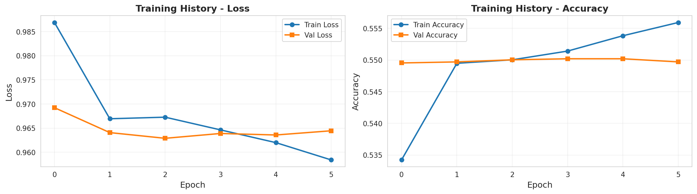

The training curves show the model converging over 6 epochs. Validation accuracy plateaus around 55%, and early stopping prevents overfitting.

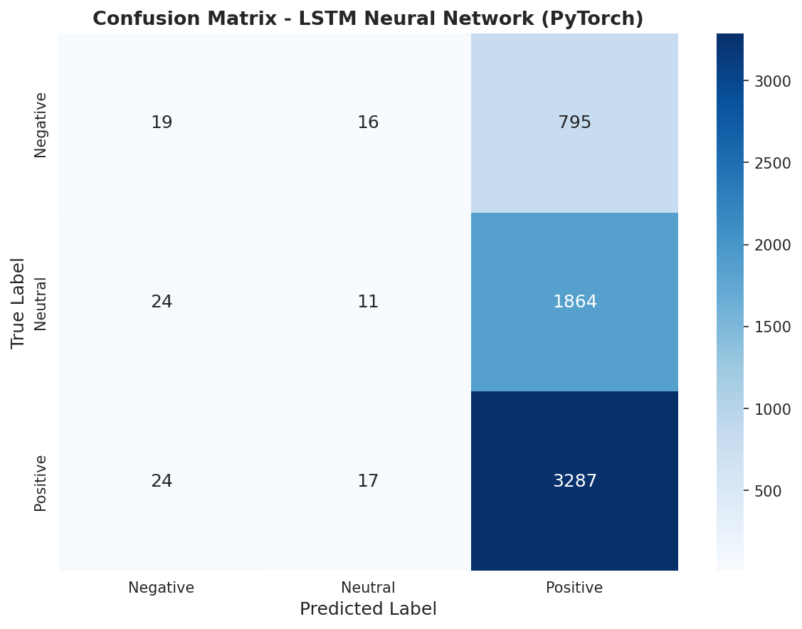

The LSTM's confusion matrix reveals a notable behavior — it predicts almost everything as **Positive**. With a small vocabulary (5K words) and short sequence length (100 tokens), the model defaulted to predicting the majority class rather than learning meaningful distinctions.

---

## Head-to-Head Comparison

All four models are evaluated on the **same held-out test set** (6,057 reviews) that was never used during training or tuning.

### Overall Metrics

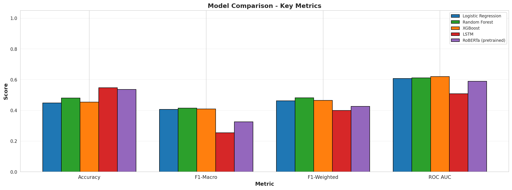

| Model | Accuracy | F1-Macro | F1-Weighted | ROC AUC |
|-------|:--------:|:--------:|:-----------:|:-------:|
| Logistic Regression | 0.448 | 0.407 | 0.462 | 0.607 |
| **Random Forest** | **0.481** | **0.414** | **0.482** | 0.611 |
| XGBoost | 0.453 | 0.409 | 0.465 | **0.620** |
| LSTM | 0.548 | 0.254 | 0.399 | 0.509 |

**Why I use F1-Macro (not accuracy):** Accuracy can be misleading with imbalanced classes. A model that predicts "Positive" for every review would get 55% accuracy — which is what the LSTM is essentially doing. F1-Macro averages the F1 score across all three classes equally, so a model has to perform well on *every* class to score high.

By F1-Macro, **Random Forest wins** (0.414), followed closely by XGBoost (0.409) and Logistic Regression (0.407).

### Confusion Matrices Side by Side

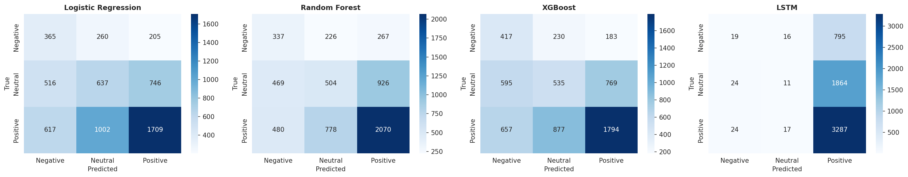

Key observations:
- **All TF-IDF models** spread predictions across all three classes, with the most confusion between Neutral and Positive (which makes sense — a 3-star and 4-star review can sound very similar)
- **The LSTM** collapses nearly everything into Positive, showing it failed to learn the minority classes with the constrained architecture

### Per-Class F1 Scores

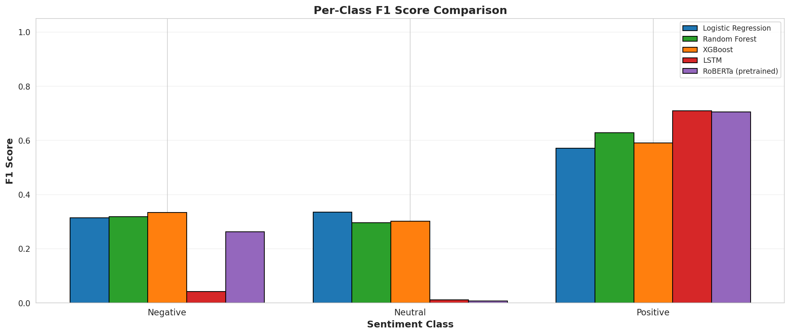

The Neutral class is the hardest for every model — 3-star reviews contain mixed language ("good company *but* poor management") that overlaps with both Negative and Positive vocabulary.

### ROC Curves by Class

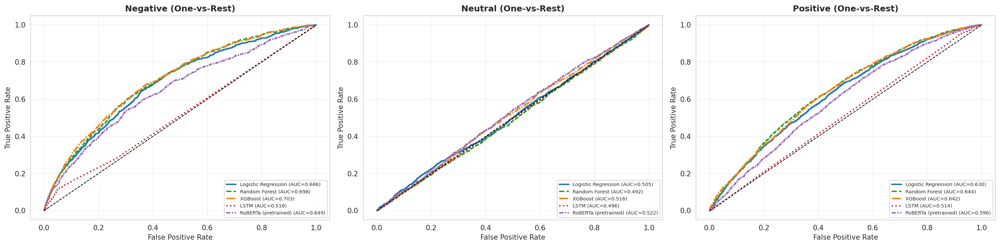

The ROC curves show that all three TF-IDF models perform similarly, with XGBoost having a slight edge on Negative class detection (AUC=0.703). The LSTM's curves hover near the diagonal (random chance), confirming it didn't learn meaningful class boundaries.

### Model Agreement

Only **28.7% of test reviews** received the same prediction from all four models. The highest pairwise agreement was between Random Forest and XGBoost (66.9%), which makes sense since both are tree-based methods working on the same TF-IDF features.

---

## Key Takeaways

1. **The traditional ML models (Logistic Regression, Random Forest, XGBoost) all performed comparably.** This is common in NLP tasks where TF-IDF features carry most of the signal. Fancy algorithms can't compensate for feature limitations.

2. **The LSTM underperformed** in this proof-of-concept configuration. Deep learning for NLP typically needs either pre-trained embeddings (like GloVe or Word2Vec), a larger vocabulary, or a transformer architecture (like BERT) to outperform TF-IDF baselines. The small vocabulary and short sequence length used here were too constrained.

3. **The Neutral class is fundamentally hard.** Three-star reviews use mixed language that overlaps with both positive and negative vocabulary. This is a known challenge in sentiment analysis — the boundary between "meh" and "good" is genuinely fuzzy in natural language.

4. **Class imbalance matters.** With only 13.7% Negative reviews, all models struggle with that class. Production systems would benefit from techniques like class-weighted loss functions, oversampling (SMOTE), or framing the problem as binary (Positive vs. Not Positive).

5. **Simple models are often good enough.** Logistic Regression, the simplest model here, was within 1-2% of the best performer on most metrics. For a production system where interpretability and speed matter, it's a strong choice.

---

## Project Structure

```
nlp_sentiment_analysis/
├── 00_data_collection/notebook.ipynb     # Download, clean, upload to S3
├── 01_eda/notebook.ipynb                 # Exploratory data analysis
├── 02_preprocessing/notebook.ipynb       # Text cleaning, train/val/test split
├── 03_tfidf_logreg/notebook.ipynb        # TF-IDF + Logistic Regression
├── 04_tfidf_random_forest/notebook.ipynb # TF-IDF + Random Forest
├── 05_tfidf_xgboost/notebook.ipynb       # TF-IDF + XGBoost
├── 06_neural_network/notebook.ipynb      # PyTorch LSTM
├── 07_comparison/notebook.ipynb          # Head-to-head model comparison
├── requirements.txt
└── README.md
```

## Technical Stack

| Component | Library |
|-----------|---------|
| Data | pandas, numpy, pyarrow |
| ML | scikit-learn, XGBoost |
| Deep Learning | PyTorch |
| Hyperparameter Tuning | Optuna |
| NLP | NLTK, TfidfVectorizer |
| Interpretability | SHAP |
| Visualization | matplotlib, seaborn |
| Cloud Storage | boto3 (AWS S3) |

## How to Run

Run notebooks in order (00 through 07). Each reads its inputs from S3 and saves outputs locally.

```bash
pip install -r requirements.txt
```

Requires AWS credentials configured for S3 access and a Kaggle account for dataset download.

