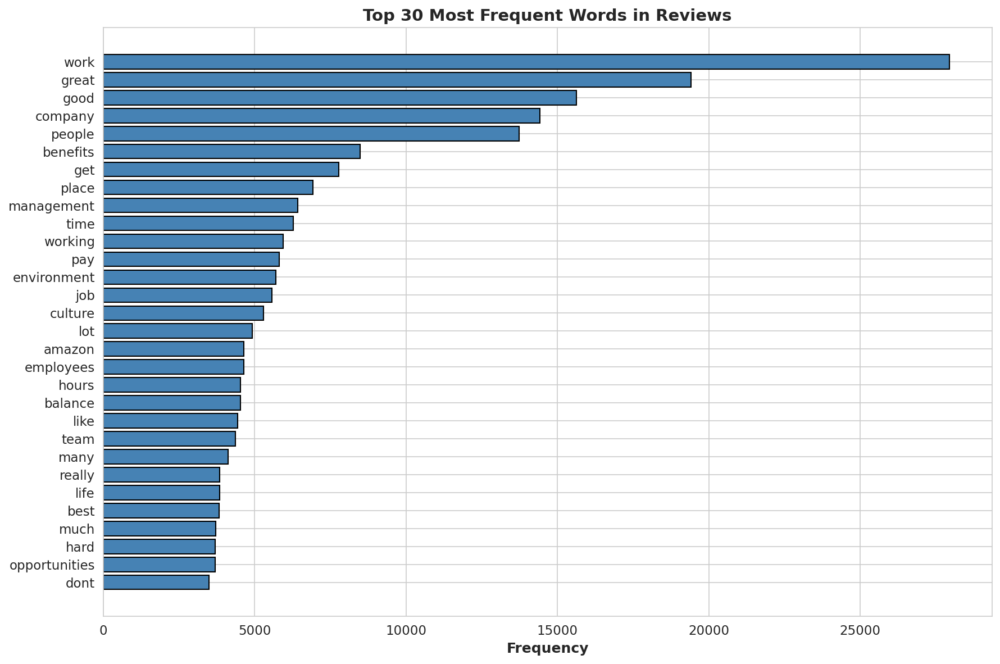
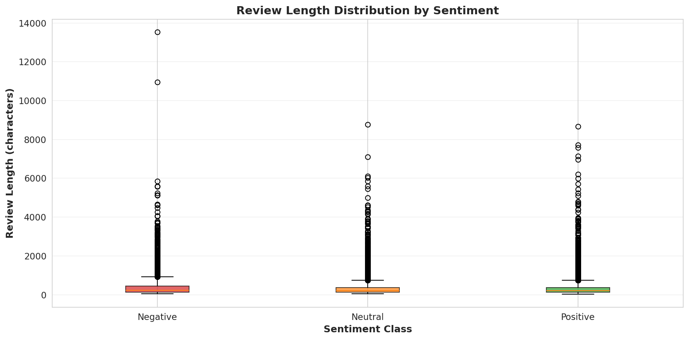
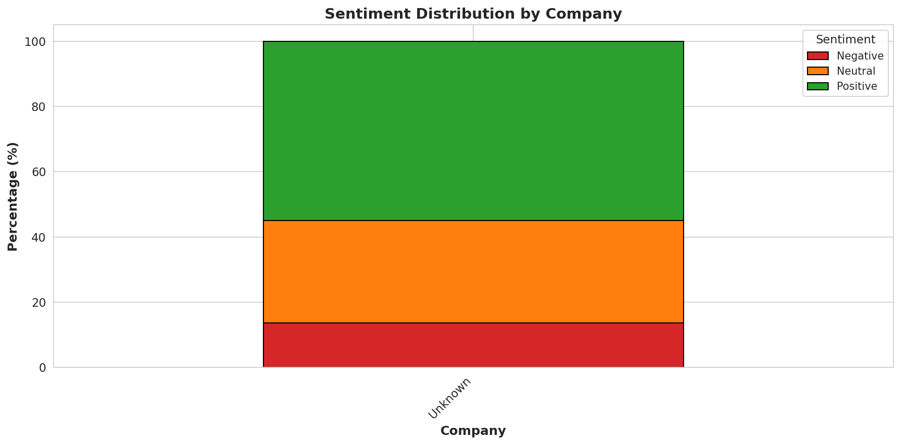
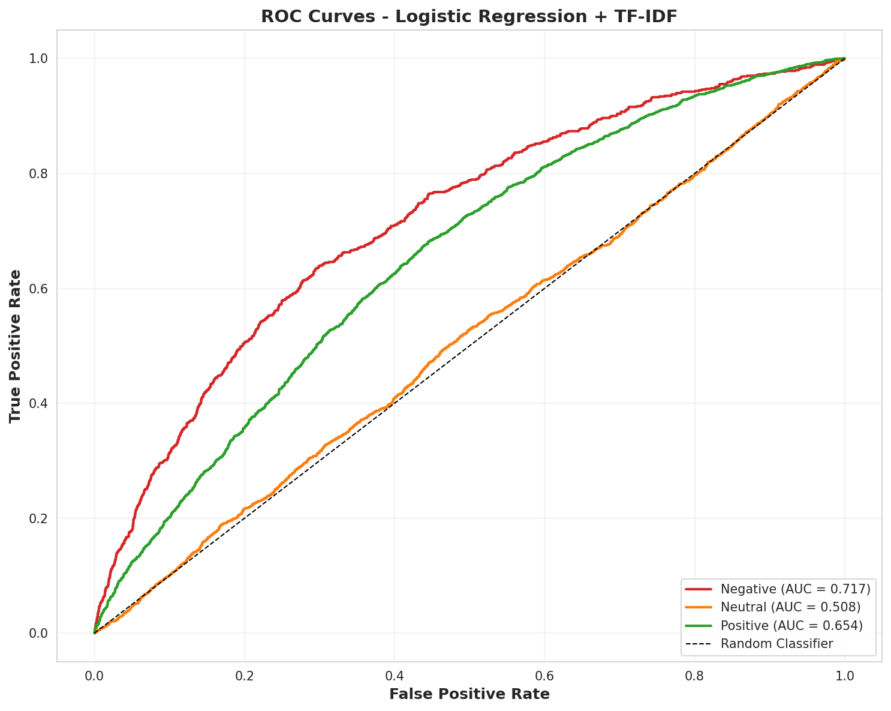
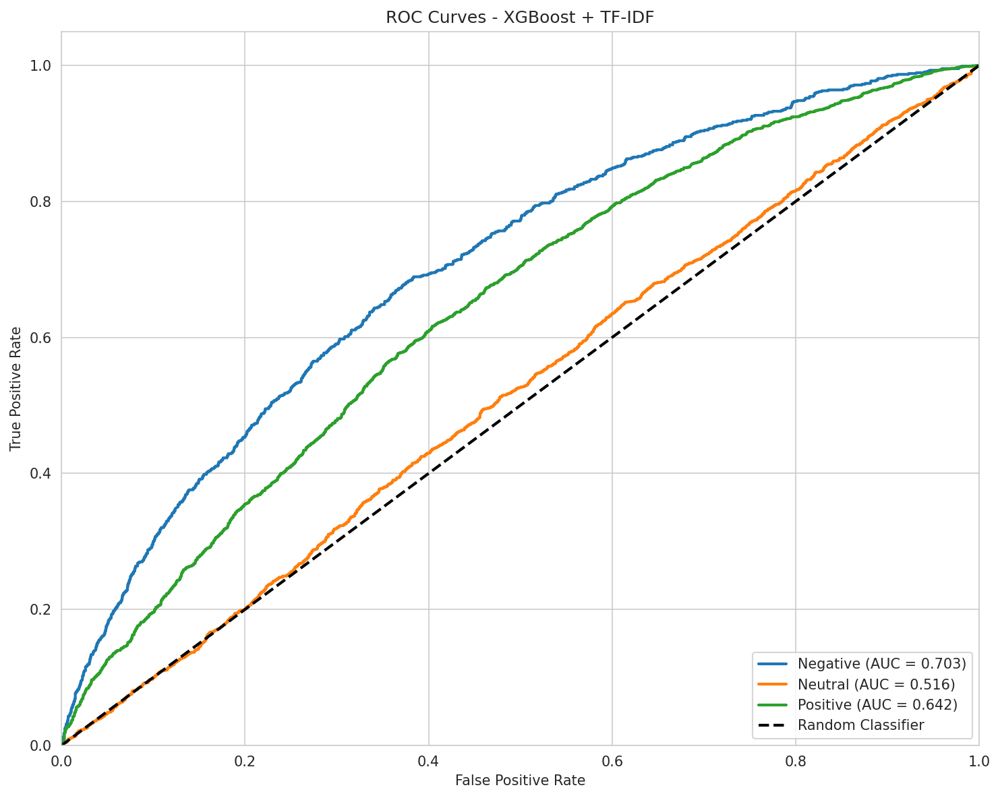
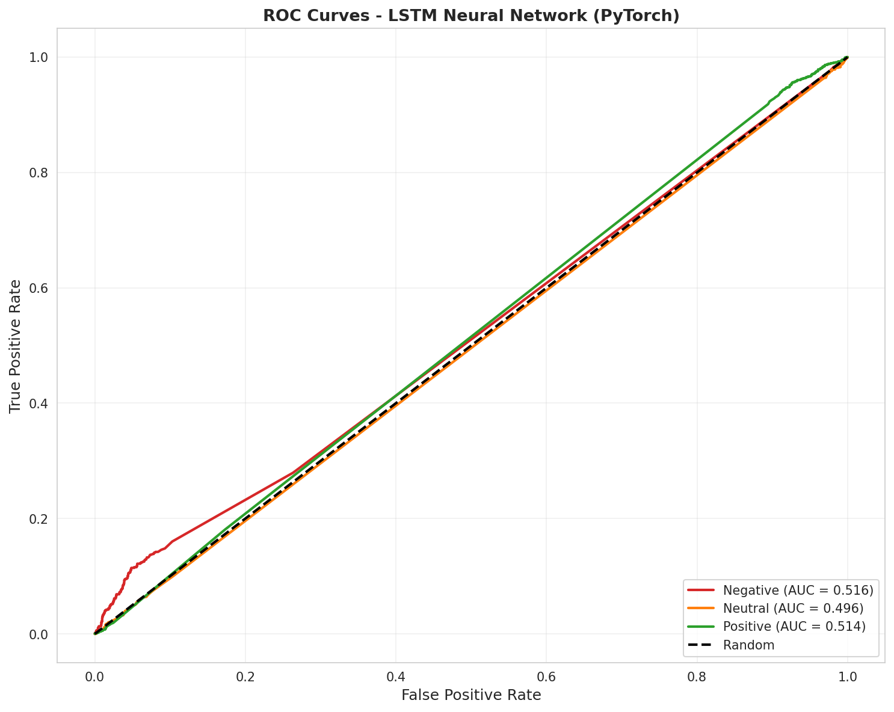
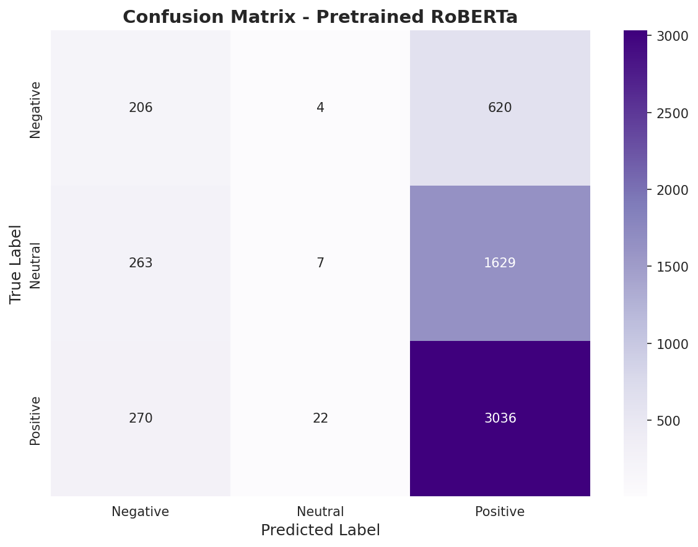
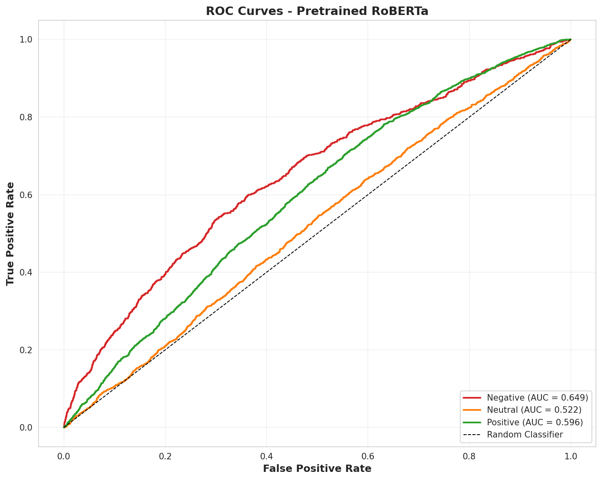

# NLP Sentiment Analysis of Employee Reviews

In this project, I built a system that reads written employee reviews and automatically determines whether the sentiment is positive, neutral, or negative — without using the star rating. Think of it like teaching a computer to understand the tone of a review just by reading the words. I tested five different approaches ranging from simple statistical models to deep learning and a pretrained language model, trained and evaluated them all on the same dataset of 30,281 employee reviews, and found that a Random Forest model paired with TF-IDF text features performed best overall with an F1-Macro score of 0.41. The project revealed that three-way sentiment classification is inherently challenging because neutral reviews often borrow vocabulary from both positive and negative language, making them difficult for any model to reliably identify.

---

## Dataset Overview

The dataset contains 30,281 employee reviews scraped from an online employer review platform. Each review includes written text (combining pros, cons, and summary) along with a star rating from 1 to 5. I mapped the star ratings into three sentiment classes:

| Rating | Sentiment | Count | Percentage |
|--------|-----------|-------|------------|
| 1-2 stars | Negative | 4,150 | 13.7% |
| 3 stars | Neutral | 9,493 | 31.3% |
| 4-5 stars | Positive | 16,638 | 54.9% |

| Property | Value |
|----------|-------|
| Total Reviews | 30,281 |
| Mean Review Length | 332 characters |
| Median Review Length | 209 characters |
| Longest Review | 13,528 characters |

The class distribution is imbalanced — there are roughly 4 times as many positive reviews as negative ones. This imbalance makes the problem harder because models can achieve deceptively high accuracy by simply predicting "positive" for everything.

---

## Exploratory Data Analysis

### Rating Distribution

This bar chart shows how the star ratings are distributed across the dataset. The most common rating is 4 stars (35.2%), followed by 3 stars (31.3%). Very few reviews give 1 star (2.1%). This skew toward positive ratings is typical of employee review platforms and directly impacts model training since there are far fewer examples of negative sentiment to learn from.

### Sentiment Distribution

After mapping star ratings to three sentiment classes, this chart shows the resulting distribution. More than half the reviews are positive, about a third are neutral, and only about one in seven is negative. This imbalance is a core challenge throughout the project and influenced my choice to use class-balanced training and F1-Macro as the primary evaluation metric.

### Review Length Distribution

This histogram shows how long the reviews are. Most reviews are quite short — the median is just 209 characters, roughly two sentences. The distribution has a long right tail, with a few reviews stretching over 10,000 characters. Short reviews give models less text to work with, making classification harder, especially for the neutral class where the sentiment signal tends to be weak.

### Word Frequency Analysis

This chart shows the 30 most common words across all reviews after removing common filler words (like "the," "is," "and"). Words like "work," "company," "good," and "great" dominate. Many of these high-frequency words are sentiment-neutral, which means models need to learn more subtle patterns — not just which words appear, but how they appear together.

### Word Frequency by Sentiment

This side-by-side comparison reveals which words are most common within each sentiment class. Negative reviews use words like "toxic," "poor," and "worst." Positive reviews favor "great," "amazing," and "culture." But neutral reviews use a mix of both positive and negative vocabulary — words like "good," "work," and "company" appear frequently across all three classes. This vocabulary overlap is the fundamental reason neutral sentiment is so hard to classify.

### Review Length by Sentiment

These box plots compare review lengths across the three sentiment classes. All three have similar median lengths, though negative reviews tend to be slightly longer — people who are unhappy often write more detailed explanations of their grievances. The similarity in lengths means that review length alone is not a reliable signal for predicting sentiment.

### Sentiment by Company

This stacked bar chart shows the sentiment breakdown by company. It provides context about the distribution of reviews across different employers and whether certain companies skew more positive or negative.

---

## Text Preprocessing

Before feeding text into the models, I cleaned and standardized it through the following pipeline:

1. **Lowercasing** — Convert all text to lowercase for consistency
2. **Punctuation removal** — Strip special characters and punctuation
3. **Stopword removal** — Remove common filler words (the, is, at, etc.)
4. **Lemmatization** — Reduce words to their base form (e.g., "running" becomes "run")

**Example:**
- Original: *"People are smart and friendly Bureaucracy is slowing things down Best Company to work for"*
- Cleaned: *"people smart friendly bureaucracy slowing thing best company work"*

### Data Split

I split the data into three sets while maintaining the same class proportions in each (stratified split):

| Split | Reviews | Purpose |
|-------|---------|---------|
| Training | 18,168 (60%) | Models learn patterns from this data |
| Validation | 6,056 (20%) | Tune hyperparameters and prevent overfitting |
| Test | 6,057 (20%) | Final unbiased evaluation — models never see this during training |

---

## Model 1: Logistic Regression + TF-IDF

TF-IDF (Term Frequency-Inverse Document Frequency) converts each review into a numerical vector by measuring how important each word is to that specific review relative to the entire collection. Logistic Regression then uses these vectors to draw decision boundaries between the three sentiment classes.

### Confusion Matrix

This grid shows what the model predicted versus what the true sentiment was. Each cell counts how many reviews fell into that combination. The diagonal (top-left to bottom-right) shows correct predictions. Off-diagonal cells show errors — for example, neutral reviews being misclassified as positive is a common mistake.

### ROC Curves

These curves measure how well the model distinguishes each sentiment class from the others across all possible confidence thresholds. A curve hugging the top-left corner indicates strong discrimination. The area under each curve (AUC) summarizes performance in a single number, where 1.0 is perfect and 0.5 is random guessing.

### Feature Importance

One advantage of Logistic Regression is interpretability — I can see exactly which words push the model toward each prediction. This chart shows the strongest positive and negative word associations for each sentiment class, providing a transparent window into the model's decision-making process.

---

## Model 2: Random Forest + TF-IDF

Random Forest builds hundreds of small decision trees, each looking at a random subset of words, and then combines their votes for a final prediction. This ensemble approach tends to be more robust than any single model because different trees catch different patterns.

### Confusion Matrix

The Random Forest confusion matrix shows improved performance on the positive class compared to Logistic Regression, with more correct predictions along the diagonal. The neutral class remains the most commonly confused category.

### ROC Curves

The ROC curves for Random Forest show similar overall discrimination ability to Logistic Regression, with slight improvements across all three classes.

### Feature Importance

Unlike Logistic Regression which shows directional word associations, Random Forest's feature importance measures how much each word contributes to overall prediction accuracy regardless of direction. The most important words are those that help split reviews into the correct sentiment class most effectively.

---

## Model 3: XGBoost + TF-IDF

XGBoost (Extreme Gradient Boosting) is another ensemble method, but instead of building trees independently like Random Forest, it builds them sequentially — each new tree focuses specifically on correcting the mistakes of the previous trees. This iterative refinement often leads to strong performance.

### Confusion Matrix

XGBoost's error pattern is similar to the other TF-IDF models, with the positive class being easiest to identify and the neutral class causing the most confusion.

### ROC Curves

XGBoost achieves the highest ROC AUC among the TF-IDF models (0.62), indicating slightly better probability calibration — its confidence scores align more closely with actual correctness.

### Feature Importance

XGBoost's feature importance is measured by "gain" — how much each word improves the model's predictions when it is used for splitting decisions. The top features tend to be sentiment-loaded words with clear positive or negative connotations.

---

## Model 4: LSTM Neural Network

An LSTM (Long Short-Term Memory) is a type of neural network designed to process sequences — in this case, sequences of words. Unlike the TF-IDF models which treat each review as a "bag of words" (ignoring order), the LSTM reads words in order and can theoretically capture meaning that depends on context and word arrangement.

### Training History

This chart shows the model's loss (error) and accuracy over each training epoch. The training loss steadily decreases, but the validation loss plateaus early — a sign that the model is not learning generalizable patterns beyond what it picks up in the first few passes through the data.

### Confusion Matrix

The LSTM confusion matrix reveals a critical problem: the model predicts "positive" for nearly every review. It achieves 55% accuracy (the highest of any model), but only because 55% of reviews actually are positive. It essentially ignores the negative and neutral classes entirely — a phenomenon called "majority class collapse."

### ROC Curves

The ROC curves hover near the diagonal line (random performance), confirming that the LSTM has not learned meaningful sentiment distinctions. With only 5,000 vocabulary words and no pretrained word embeddings, the model lacked sufficient information to overcome the class imbalance.

---

## Model 5: Pretrained DistilBERT Transformer

DistilBERT is a compact version of BERT, a language model pretrained on millions of text documents. The specific model I used was already fine-tuned for three-class sentiment analysis on ~124 million tweets. I applied it directly to the employee reviews without any additional training (zero-shot transfer) to test whether general-purpose sentiment understanding transfers to this specific domain.

### Confusion Matrix

Despite having 66 million parameters and extensive pretraining, DistilBERT shows a similar bias toward predicting positive sentiment. It correctly identifies most positive reviews (91% recall) but nearly ignores the neutral class entirely. The core issue is domain mismatch — it was trained on informal tweets, while these are structured employee reviews where a "neutral" 3-star review might use positive-sounding language like "good" and "great."

### ROC Curves

The ROC curves show modest discrimination ability (AUC = 0.59), better than the LSTM but worse than the simpler TF-IDF models. This demonstrates that model scale alone does not guarantee performance — domain alignment matters more than parameter count.

---

## Model Comparison

### Metrics Comparison

This grouped bar chart puts all five models side by side across four evaluation metrics. The TF-IDF-based models (Logistic Regression, Random Forest, XGBoost) form a consistent cluster of performance, while the deep learning models (LSTM, DistilBERT) show divergent patterns — high accuracy but low F1-Macro, indicating they rely on majority class prediction rather than balanced classification.

| Model | Accuracy | F1-Macro | F1-Weighted | ROC AUC |
|-------|----------|----------|-------------|---------|
| Logistic Regression | 0.448 | 0.407 | 0.462 | 0.607 |
| **Random Forest** | **0.481** | **0.414** | **0.482** | 0.611 |
| XGBoost | 0.453 | 0.409 | 0.465 | **0.620** |
| LSTM | 0.548 | 0.254 | 0.399 | 0.509 |
| DistilBERT | 0.536 | 0.325 | 0.426 | 0.589 |

- **F1-Macro** (primary metric): Averages F1 across all three classes equally, so it is not inflated by good performance on just the majority class. Random Forest wins at 0.414.
- **ROC AUC**: Measures overall discrimination ability. XGBoost leads at 0.620.
- **Accuracy**: Can be misleading with imbalanced classes. LSTM has the highest at 0.548, but only because it predicts "positive" for almost everything.

### ROC Curve Comparison

This overlay shows all five models' ROC curves across the three sentiment classes on the same plot. The TF-IDF models cluster together with similar performance, while the LSTM curves sit near the diagonal (random chance), and DistilBERT falls in between.

### Confusion Matrix Comparison

Placing all five confusion matrices side by side reveals the striking behavioral difference: the TF-IDF models distribute predictions across all three classes (with varying accuracy), while the LSTM and DistilBERT concentrate almost all predictions in the positive class.

### Per-Class F1 Scores

This chart breaks down F1 scores by sentiment class for each model. The pattern is clear across all models: positive sentiment is easiest to detect (F1 0.57-0.71), neutral is moderately difficult (F1 0.01-0.34), and negative is the hardest (F1 0.04-0.32). The LSTM and DistilBERT achieve high positive F1 but near-zero scores for neutral and negative, confirming their majority class collapse.

| Model | Negative F1 | Neutral F1 | Positive F1 |
|-------|-------------|------------|-------------|
| Logistic Regression | 0.31 | 0.34 | 0.57 |
| Random Forest | 0.32 | 0.30 | 0.63 |
| XGBoost | 0.32 | 0.32 | 0.60 |
| LSTM | 0.04 | 0.01 | 0.71 |
| DistilBERT | 0.26 | 0.01 | 0.70 |

---

## Key Design Decisions

| Decision | Rationale |
|----------|-----------|
| F1-Macro as primary metric | With imbalanced classes, accuracy rewards models that predict the majority class. F1-Macro weights all three classes equally, providing a more honest measure of true classification ability. |
| Five diverse model types | Comparing simple statistical models, ensemble methods, a neural network, and a pretrained transformer provides a thorough exploration of the accuracy-complexity tradeoff. |
| TF-IDF with 3,000 features | Captures the most informative words while keeping the feature space manageable. Sublinear term frequency dampens the impact of very common words. |
| Class-balanced training | All models used class weighting or balanced sampling to compensate for the 4:2.3:1 class ratio, ensuring the minority class (negative) gets adequate representation during training. |
| Zero-shot DistilBERT | Testing a pretrained model without fine-tuning reveals the limits of transfer learning across domains — an important finding for practical NLP applications. |
| Bayesian hyperparameter tuning | Optuna efficiently searches the hyperparameter space in 5-10 trials per model, maximizing performance without exhaustive grid search. |
